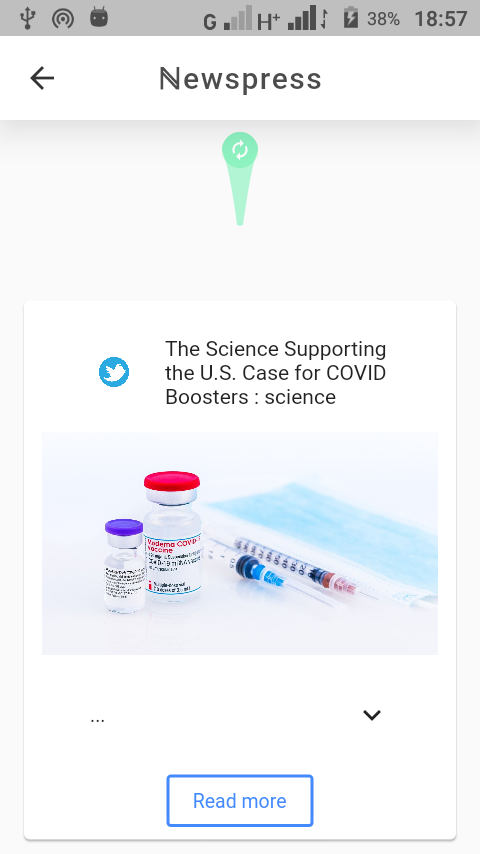
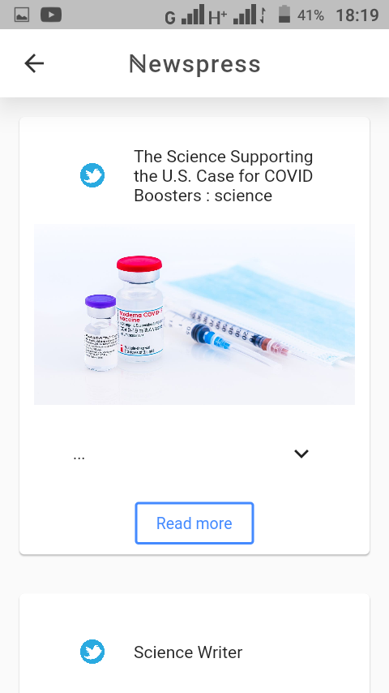

<p style='font-size:250%; color:orange'>
ℕ𝕖𝕨𝕤𝕡𝕣𝕖𝕤𝕤
</p>

newspress is an application built on-top  of [Free news apis](https://newscatcherapi.com). Big thanks to the developers at [News Catcher Api](https://www.linkedin.com/company/newscatcherapi) for the previledge of the free news.


## Running the program:
Head-on to [this](https://newscatcherapi.com) site for the api key and after getting it; if you're using VS code press **CTRL + SHIFT + F** and replace this:
```dart
const apikey = String.fromEnvironment('apiKey');
```
with this:
```dart
const apikey = 'Your api key here';
```
**OR**

Navigate to the following dirs and open the file: 
**_packages/lib/src/data/datasources/remote_data_source.dart_**

and do thesame as indicated above. Then finally run:

```bash
$ flutter build apk -v
```

## Screenshots:

 
 
 




+ # The programe uses: 
  + **Flutter_riverpod** for it state management.

  + **Clean code Architecture** and **SOLID** principle _(I'm still learning most of this things, I hope to get a good grasp of this principle along the run.)_.

  + **QuickType** for generation of model for the [apis](https://newscatcherapi.com).

  + **Errors:** A package from [NoScopeDev](git://github.com/NoScopeDevs/errors) for handling errors.

  + **Network_manager:** A package also from [NoScopeDev](git://github.com/NoScopeDevs/network_manager)
  
  + **GetWidget:** This package is wonderfully packed with a lot of goodies. Many thanks to the developers. check it out [here](https://getwidget.dev/)

Those are not all the packages used, I only shortlisted them because of their importance to the app at large.


# Contributors

 

1. <font color='orange'>Gaurav Tantuway</font>, you can reach him [here](http://solo.to/dev.gaurav_tantuway/).

2. <font color='orange'>PetDom Graphics</font>